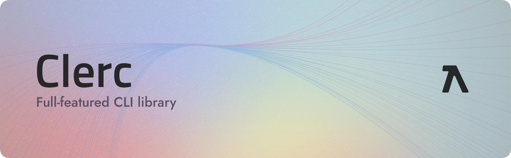

<p align="center">
	<a target="_blank" href="https://clerc.so1ve.dev" noreferrer noopener>Clerc</a> is a full-featured library (tool set) for building CLI Apps in Node.js, Deno or Bun.
</p>

<div align="center">

[](https://npmjs.org/package/clerc)
[](https://github.com/clercjs/clerc/actions/workflows/conventional-ci.yml)
[](https://npmjs.org/package/clerc)
[](https://github.com/clercjs/clerc/blob/main/package.json)

</div>

<hr/>

<!-- toc -->

- [✨ Features](#-features)
- [😊 The simplest CLI example](#-the-simplest-cli-example)
- [📖 Documentation](#-documentation)
- [🦄 Examples](#-examples)
- [🤔 More...](#-more)

<!-- tocstop -->

> [!NOTE]  
> This package is ESM-only.

# ✨ Features

- **Lightweight** - Dependencies are bundled.
- **Plugin system** - Add rich features on demand.
- **Chainable APIs** - Composable.
- **Developer friendly** - Strongly typed, converts flags and parameters to camelCase.
- **Parses parameters** - No need to read them by yourself.

# 😊 The simplest CLI example

Install clerc, and create a file named `cli.mjs`:

```ts
import { Cli } from "clerc";

Cli() // Create a new Clerc instance with help and version plugins installed
  .scriptName("foo") // CLI Script Name
  .description("A foo CLI") // CLI Description
  .version("0.0.0") // CLI Version
  .command(
    "bar", // Command name
    "A bar command", // Command description
  )
  .on(
    "bar",
    (
      _ctx, // The command context, but we haven't used it yet
    ) => {
      console.log("Hello, world from Clerc!");
    },
  )
  .parse(); // Parse the arguments and run!
```

Then run: `node cli.mjs bar`. It should log in your shell: `Hello, world from Clerc!`

# 📖 Documentation

Please see https://clerc.so1ve.dev.

# 🦄 Examples

Check the examples made with `Clerc`:

- [Greeting](./examples/greeting) - The example from above
- [Bumpp](./examples/bumpp) - Reimplementation of [`Bumpp`](https://github.com/antfu/bumpp)'s CLI

# 🤔 More...

## Why using Clerc?

Clerc uses [`@clerc/parser`](https://github.com/clercjs/clerc/blob/main/packages/parser) to parse arguments. It is strongly-typed, which brings you better DX. It is powerful(supports custom type) and quite small and performant!

Clerc has a plugin system, which means you can add features on demand (e.g. auto completions, help text generation...). It also provides chainable APIs for better composability.

Clerc's flexible architecture and plugin system offer vast potential for further exploration and customization in diverse CLI application scenarios. There are more and more opportunities to leverage Clerc's capabilities to create unique and powerful command-line tools!

## 📝 License

[MIT](./LICENSE). Made with ❤️ by [Ray](https://github.com/so1ve)
